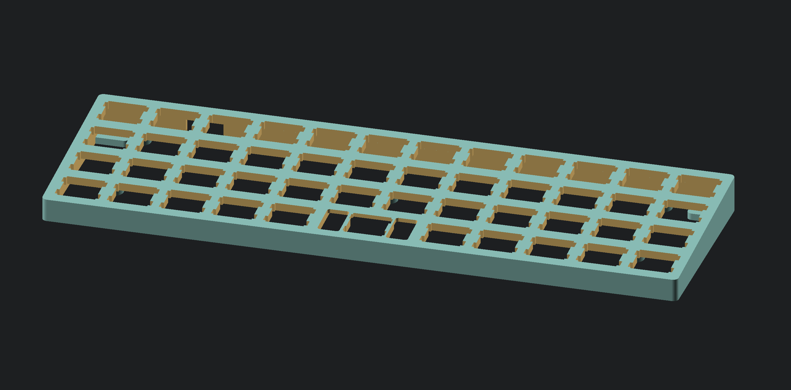

# Slim and simple BM40 (Planck) keyboard case

This is a very small footprint, low profile and tented case for BM40 mechanical keyboard. It might also fit Planck, as BM40 is a Planck clone (**but I have not tested it**). I think, that with a bit of hot glue you can also use it for hand wired build with a ProMicro.

It is a really low profile case - hot swap sockets almost touch the desk on the lower part.

Design was printed and is currently a case for one of my BM40 keyboards. If you have a small printer (like me) use the split design and super-glue the halves. If you have a larger printer, just use the base file and print it all at once.

I've been printing it with supports enabled and no-support zone on USB connector hole, but printing without support was also ok (feet plates didn't look 100% correct, but it worked).

If you are into Ortholinear keyboards. You can check out new keyboard I'm currently working on here: [D1Keyboards](https://D1keyboards.com).

## Here's how it looks like

## How to get it

Get STL files here:

[https://www.thingiverse.com/thing:4937726](https://www.thingiverse.com/thing:4937726)
